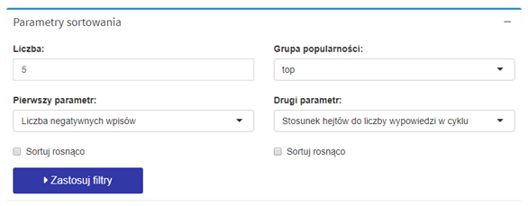
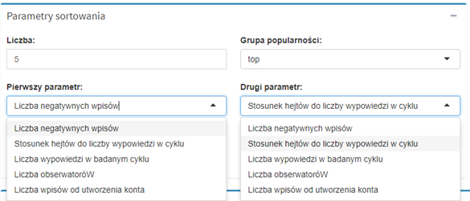
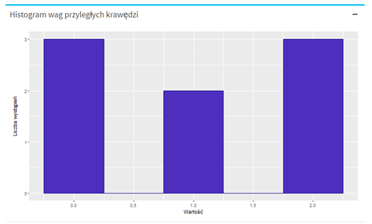
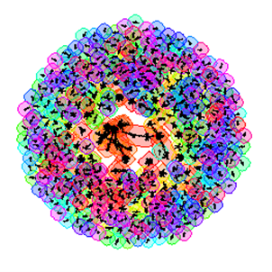
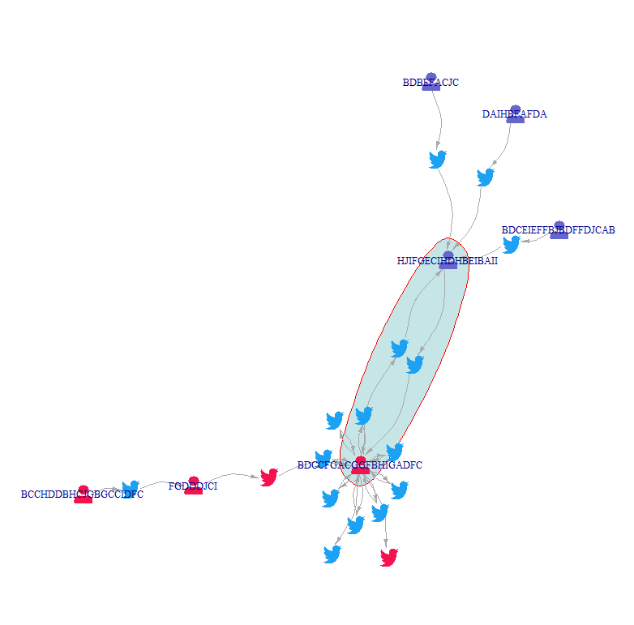
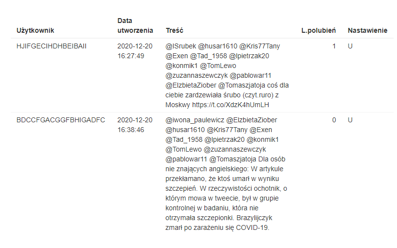

Wykrywanie mowy nienawiści
================
Mateusz Kostrzewski
March 8, 2021

#### ShinyApp.io: [hatedetection](https://matheok.shinyapps.io/hatedetection/)

#### Kaggle: [polish-twitter-sentiments](https://www.kaggle.com/mateuszkostrzewski/polish-twitter-sentiments)

## Wprowadzenie

Zaimplementowana aplikacja umożliwia analizę portalu społecznościowego
Twitter w celu wykrycia podmiotów stanowiących potencjalne zagrożenie.
Wykorzystane metody grafowo-sieciowe wykrywają charakterystyczne grupy
użytkowników, wskazują niejednoznaczne wypowiedzi oraz ułatwiają
monitorowanie nastrojów społecznych.

## Graf nastrojów użytkowników

Sklasyfikowane wpisy i użytkownicy stanowią wierzchołki grafu
utworzonego przy użyciu biblioteki igraph. Zmienne ramek danych
zamieniono na atrybu-ty wierzchołków. Dodano atrybut roli „U” dla
użytkowników i „S” dla wypowiedzi. Relacja wpisu i jego autora opisana
jest krawędzią.

Na potrzeby wizualizacji skonstruowano las (cztery drzewa) z czterema
korzeniami oznaczającymi grupy popularności użytkowników. Zróżnicowano
po-ziom każdego korzenia, aby wierzchołki nie nachodziły na siebie.
Drzewa zaprezentowano w postaci okręgu. Kwadratowymi wierzchołkami
oznaczono użytkow-ników. Ukryto krawędzie miedzy użytkownikami a
korzeniami. Liście w postaci kół to wpisy. Zmieniono kolor krawędzi,
związanych z negatywnymi wpisami.

**Rys.1** obrazuje nastroje użytkowników portalu Twitter dla każdego
dnia. Wybrano i zobrazowano pierwszy analizowany dzień. Zgodnie z
legendą: kolorem czerwonym i literą oznaczono wpisy i użytkowników
sklasyfikowanych jako negatywne, a kolorem niebieskim wpisy neutralne.
Liczba wypowiedzi w rozpatrywanym tygodniu wynosiła ok. 6700.

**Rys.1. Przykład dobowego grafu nastrojów**

## Grafowa analiza modeli autorów negatywnych wypowiedzi

Zaproponowana metoda wykorzystuje właściwości histogramu grafu
aktywności. Zamierzeniem jest przydzielenie autora wpisów do wykrytych
charakte-rystycznych wzorców użytkowników Twittera. Podczas
implementacji aplikacji zauważono kilka z nich:

**Anomalia** - popularni użytkownicy - najczęściej konta serwisów
informa-cyjnych, cytujących negatywne słowa lub używających w innym
kontek-ście. Charakteryzują się wysoką częstotliwością postów
neutralnych i licznymi obserwatorami..

**Mąciciel** - pojedyncze osoby popularne: mała aktywność, szeroki
posłuch.

**Wzorce mieszane** – popularne osoby umieszczający statusy informacyjne
sporadycznie krytykujące konkretne obozy polityczne.

**Spamer** - wysoka częstotliwość hejtów o niskiej lub zerowej
popularności. Cechą szczególną jest używanie klawisza Caps Lock i
wulgaryzmów do wzmocnienia przekazu.

### Filtrowanie wyników

Wybór konkretnej grupy docelowej umożliwia panel filtrów widoczny na
**Rys. 2** i **Rys. 3**. Dostępne parametry to liczba grafowych historii
aktywności, grupa popularności, zmienne na podstawie których zostaną
posortowania wyniki oraz opcjonalna zmiana opcji sortowania na malejące.
Domyślnie ustawione są: liczba negatywnych wpisów i stosunek hejtów do
wszystkich w badanym tygodniu.

**Rys.2. Przykład wyszukiwania grafowej historii wpisów użytkowników**

**Rys.3. Dostępne opcje sortowania grafowych historii wpisów.**

**Rys. 4.** przedstawia przykładowy graf historii wpisów użytkownika.
Graf składa się z wierzchołków stanu reprezentującego każdy dzień. Do
każdego z nich przyłączone są wierzchołki oznaczające pojedyncze wpisy
utworzone przez ich autora w danym dniu. Krawędź poprowadzona do wpisu
sklasyfikowanego jako neutralny (kolor niebieski) ma zerową wagę, a do
wpisu negatywnego (kolor czerwony) wagę równą liczbie użytych
negatywnych słów. Krawędzie o dodatniej wadze są kolorowane na czerwono.
Węzły są skalowane według liczby polu-bień. Możliwe jest kolorowanie
wierzchołków stanu w zależności od nastawienia w danym dniu.

**Rys.4 Przykład dobowego grafu nastrojów**.

**Rys. 5.** przedstawia aktywność pierwszego znalezionego użytkownika.
Wyświetlony panel składa się z grafu historii wpisów użytkownika, listy
hejtów i zredukowanego histogram wag przyległych krawędzi na podstawie
grafu historii wpisów.

**Rys. 5. Pierwszy wynik wyszukania grafowej historii wpisów**

**Rys. 6.** przedstawia zredukowany histogram wag przyległych krawędzi
na podstawie przykładowego grafu historii wpisów. Zauważa się, że trzy
wierzchołki stanów reprezentujących każdy dzień uzyskały sumę wag
przyległych krawędzi równą 2. Oznacza to, że w tych dniach użytkownik
użył dwóch nega-tywnych słów. Brak aktywności (suma wag przyległych
krawędzi równa 0) odnotowano pierwszego, szóstego i ostatniego dnia. Na
podstawie publikacji Y. Manolopolusa pt. “Structurebased similarity
search with graph histograms” można zastosować analizę histogramów wag
przyległych krawędzi i wykryć wzorce.

**Rys. 6. Zredukowany histogram wag przyległych krawędzi na podstawie
przykładowego grafu historii wpisów użytkownika.**

## Klasteryzacja i detekcja cykli z negatywnymi aktorami

Dokonano podziału grafu wypowiedzi na podgrafy korzystając z funkcji
pakietu igraph – cluster\_walktrap. Wynik klasteryzacji algorytmem
walktrap przedstawiono na **Rys. 7**. Posortowano społeczności według
ich liczebności. Poddano analizie grupy zawierające przynajmniej jednego
hejtera.

**Rys. 7. Wynik podziału grafu wypowiedzi na klastry.**

Wyszukano cykle funkcją all\_simple\_paths. Interesujące są tylko te
zbiory wierzchołków o liczności większej bądź równej cztery Przykładowy
wynik analizy zamieszczono na **Rys.8**. Węzły przedstawione jako ikony
osób to autorzy wypowiedzi. Logotypy Twittera reprezentują wypowiedzi.
Są one skierowane do konkretnych odbiorców. Autorzy oznaczeni pętlą z
błękitnym wypełnieniem i czerwoną krawędzią są w cyklu. W relacji
uczestniczą osoby sklasyfikowane jako negatywna i neutralna.

**Rys. 8. Przykładowy klaster z cyklem, w którym uczestniczą negatywni
użytkownicy.**

Wymiana zdań przez dwóch uczestników została dokładnie opisana
chro-nologiczną listą wypowiedzi znajdującej się na **Rys. 9**.
Analizując konkretną sytuację nasuwa się wniosek, że osoba
sklasyfikowana jako hejter została sprowokowana i wbrew oczekiwaniom nie
odpowiedziała atakiem.

**Rys. 9. Wypowiedzi użytkowników w przykładowym klastrze i cyklu.**

## Zastosowane narzędzia

[tidyverse](https://www.tidyverse.org/)
[shiny](https://shiny.rstudio.com/) [igraph](https://igraph.org/)

## Źródło

“Projekt i implementacja aplikacji wykorzystującej metody
grafowo-sieciowe do analizy i wykrywania zagrożeń w sieci”,

M. Kostrzewski, Warszawa 2021
